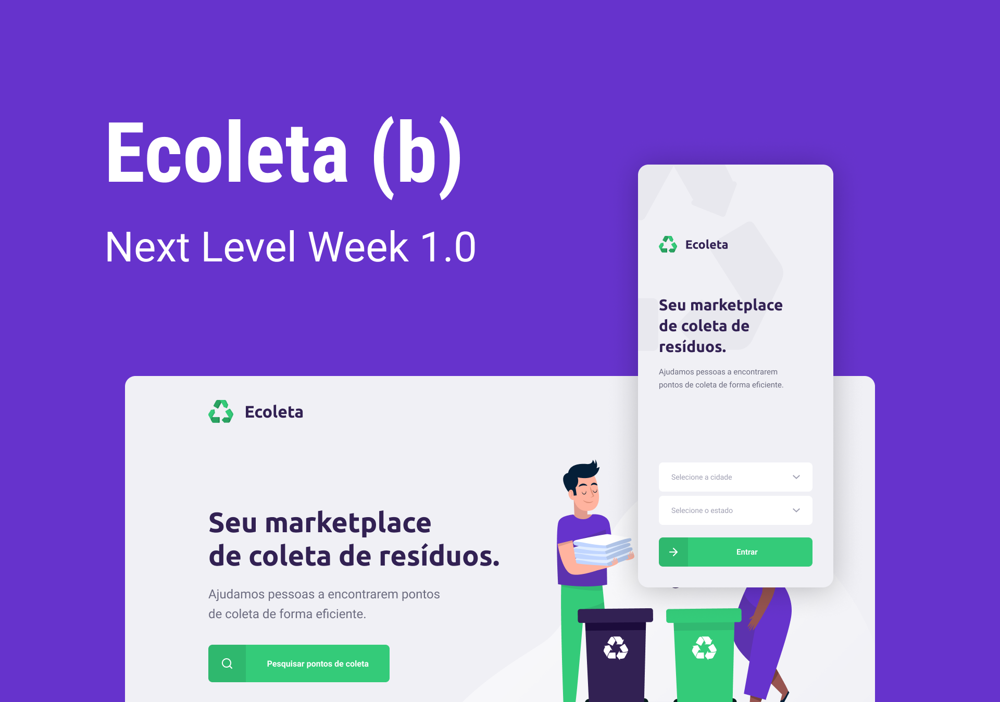

<h3 align="center">
    
</h3>

# Índice

- [Sobre](#sobre)
- [Tecnologias Utilizadas](#tecnologias-utilizadas)
- [Resultados](#resultados)
- [Como Usar](#como-usar)

<a id="sobre"></a>

## Sobre

O <strong>Ecoleta</strong> é uma aplicação Web e Mobile que tem como objetivo ajudar pessoas a encontrarem pontos de coleta de vários tipos de resíduos para reciclagem.

Essa aplicação foi construída <strong>Next Level Week #01</strong> distribuída pela [Rocketseat](https://rocketseat.com.br/).

## Tecnologias Utilizadas

- [TypeScript](https://www.typescriptlang.org/)
- [Node.js](https://nodejs.org/en/)
- [ReactJS](https://reactjs.org/)
- [React Native](https://reactnative.dev/)

## Resultados

- O layout utilizado como base para o desenvolvimento da Aplicação está disponível no **[Figma](https://www.figma.com/file/OBw5Pm9PSkzdiAJdMbWPjs/NLW%2301-Ecoleta)**;

### Resultado WEB:

<h1 align="center">
    
</h1>

### Resultado MOBILE:

<h1 align="center">
    
</h1>

## Como usar

- ### **Pré-requisitos**

  - É necessário possuir o **[Node.js](https://nodejs.org/en/)** instalado na máquina;
  - E também ter um gerenciador de pacotes seja o **[NPM](https://www.npmjs.com/)** ou **[Yarn](https://yarnpkg.com/)**;
  - Por fim, ter o **[Expo](https://expo.io/)** instalado de forma global na máquina.

1. Clonando o Projeto :

```sh
  $ git clone https://github.com/alonsofritz/ecoleta.git
```

2. Executando a Aplicação:

```sh
  # Instale as dependências
  $ npm install

  ## Crie o banco de dados
  $ cd server
  $ npm run knex:migrate
  $ npm run knex:seed

  # Inicie a API
  $ npm run dev

  # Inicie a aplicação web
  $ cd web
  $ npm start

  # Inicie a aplicação mobile
  $ cd mobile
  $ npm start
```

## Ministrado por:

**[Diego Fernandes](https://github.com/diego3g)** para a **Next Level Week #01**.

## License

Esse projeto está sob a licença MIT. Veja o arquivo [LICENSE](LICENSE.md) para mais detalhes.

</br>
</br>

<h3 align="center">
    
</h3>

<p align="center">
  <a href="https://rocketseat.com.br">
    
  </a>
  <a>
  
</p>

---
<h4 align="center">
    :rocket: Feito por <a href="https://www.linkedin.com/in/alonsofritz/" target="_blank">Alonso Fritz</a>
</h4>